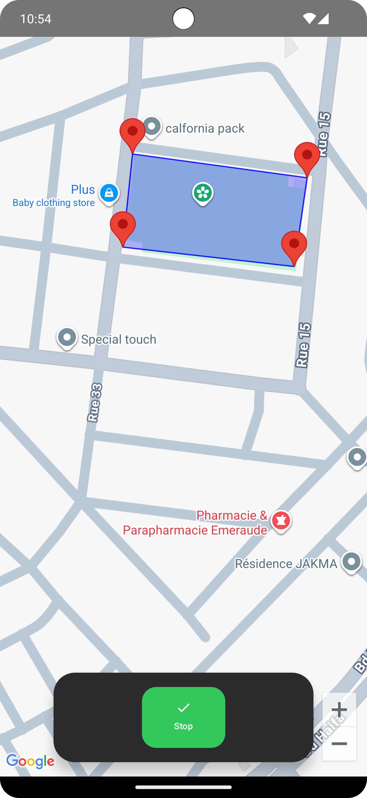
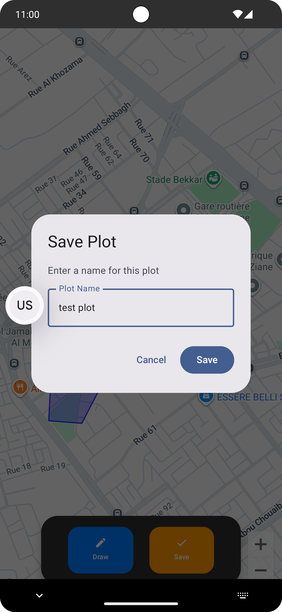
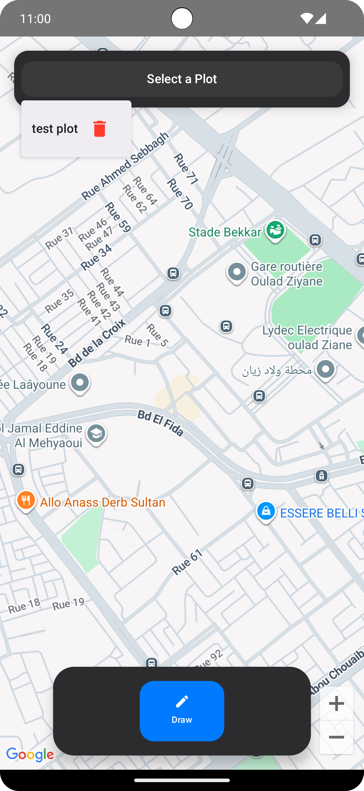
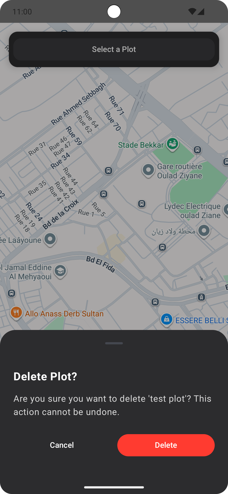

# Plot Mapping Android Application

A modern Android application for drawing and managing geographical plots on Google Maps. Built with Jetpack Compose, Clean Architecture, and Room Database.

## 📱 Features

- **Interactive Map Drawing**: Draw custom polygons on Google Maps by tapping points
- **Plot Management**: Save, view, and delete geographical plots
- **Real-time Visualization**: See your plots rendered on the map with markers and polygons
- **Persistent Storage**: All plots are saved locally using Room Database
- **Modern UI**: Built with Jetpack Compose and Material 3 design
- **Smooth Animations**: Elegant fade and scale animations for UI elements
- **Delete Confirmation**: Bottom sheet confirmation dialog before deleting plots

## 🏗️ Architecture

This project follows **Clean Architecture** principles with clear separation of concerns:

```
📦 Project Structure
├── 📂 data
│   ├── 📂 local
│   │   ├── PlotDatabase.kt          # Room database
│   │   ├── PlotDao.kt                # Database access object
│   │   └── entity/PlotEntity.kt      # Database entity
│   └── 📂 repository
│       └── PlotRepositoryImpl.kt     # Repository implementation
├── 📂 domain
│   ├── 📂 model
│   │   └── Plot.kt                   # Domain model
│   └── 📂 repository
│       └── PlotRepository.kt         # Repository interface
├── 📂 presentation
│   ├── 📂 components
│   │   ├── GoogleMapView.kt          # Map composable
│   │   ├── PlotDropdown.kt           # Plot selector
│   │   ├── SavePlotDialog.kt         # Save dialog
│   │   └── DeleteConfirmationBottomSheet.kt
│   ├── 📂 screens
│   │   └── MapScreen.kt              # Main screen
│   └── 📂 viewmodel
│       └── MapViewModel.kt           # ViewModel
└── 📂 di
    └── AppModule.kt                  # Dependency injection
```

## 🛠️ Tech Stack

- **Language**: Kotlin
- **UI Framework**: Jetpack Compose
- **Architecture**: MVVM + Clean Architecture
- **Dependency Injection**: Koin
- **Database**: Room
- **Maps**: Google Maps Compose
- **Async**: Kotlin Coroutines & Flow
- **JSON Parsing**: Gson

## 📋 Requirements

- Android Studio Hedgehog or newer
- Minimum SDK: 24 (Android 7.0)
- Target SDK: 34 (Android 14)
- Google Maps API Key

## 🚀 Getting Started

### Clone the Repository

```bash
git clone https://github.com/khalidabdou/abdellahkhalid_android_Test.git
cd abdellahkhalid_android_Test
```

### Setup Google Maps API Key

1. Get your API key from [Google Cloud Console](https://console.cloud.google.com/)
2. Open `app/src/main/res/values/strings.xml`
3. Replace the API key:
```xml
<string name="API_KEY">YOUR_API_KEY_HERE</string>
```

### Build and Run

1. Open the project in Android Studio
2. Sync Gradle files
3. Run the app on an emulator or physical device

## 📥 Download APK

Download the latest debug APK:

**[Download APK](https://github.com/khalidabdou/abdellahkhalid_android_Test/raw/main/app/debug/app-debug.apk)**

> Note: This is a debug build. For production use, generate a signed release APK.

## 🎯 How to Use

1. **Start Drawing**
   - Tap the blue "Draw" button
   - Tap on the map to add points (minimum 3 points required)
   - Tap "Stop" (green button) when finished

2. **Save Plot**
   - After stopping, tap the orange "Save" button
   - Enter a name for your plot
   - Tap "Save" in the dialog

3. **View Saved Plots**
   - Use the dropdown at the top to select a plot
   - The map will automatically zoom to show the selected plot

4. **Delete Plot**
   - Select a plot from the dropdown
   - Tap the red delete icon next to the plot name
   - Confirm deletion in the bottom sheet

## 🎨 Key Features Explained

### Clean Architecture
- **Domain Layer**: Business logic and models
- **Data Layer**: Database and repository implementations
- **Presentation Layer**: UI components and ViewModels

### Dependency Injection with Koin
```kotlin
val appModule = module {
    single { PlotDatabase }
    single { PlotDao }
    single<PlotRepository> { PlotRepositoryImpl(get()) }
    viewModel { MapViewModel(get()) }
}
```

### Data Persistence
Plots are stored in Room Database with coordinates serialized as JSON:
```kotlin
@Entity(tableName = "plots")
data class PlotEntity(
    @PrimaryKey(autoGenerate = true) val id: Int = 0,
    val name: String,
    val coordinates: String,  // JSON format
    val centerLat: Double,
    val centerLng: Double,
    val createdAt: Long
)
```

### Reactive UI with Flow
```kotlin
val plots: StateFlow<List<Plot>> = repository.getAllPlots()
    .stateIn(viewModelScope, SharingStarted.WhileSubscribed(5000), emptyList())
```

## 📸 Screenshots

<table>
  <tr>
    <td align="center">
      
      <br/>
      <b>Main Map View</b>
    </td>
    <td align="center">
      
      <br/>
      <b>Drawing Mode</b>
    </td>
    <td align="center">
      
      <br/>
      <b>Plot Selection</b>
    </td>
    <td align="center">
      
      <br/>
      <b>Save Plot Dialog</b>
    </td>
  </tr>
</table>

## 🤝 Contributing

Contributions are welcome! Please feel free to submit a Pull Request.


## 👨‍💻 Author

**Khalid Abdellah**
- GitHub: [@khalidabdou](https://github.com/khalidabdou)

## 🙏 Acknowledgments

- Google Maps Android API
- Jetpack Compose team
- Koin framework
- Room Database

---

**Made with ❤️ using Kotlin and Jetpack Compose**
